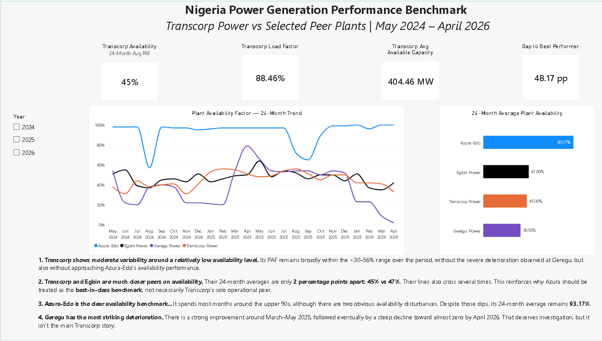
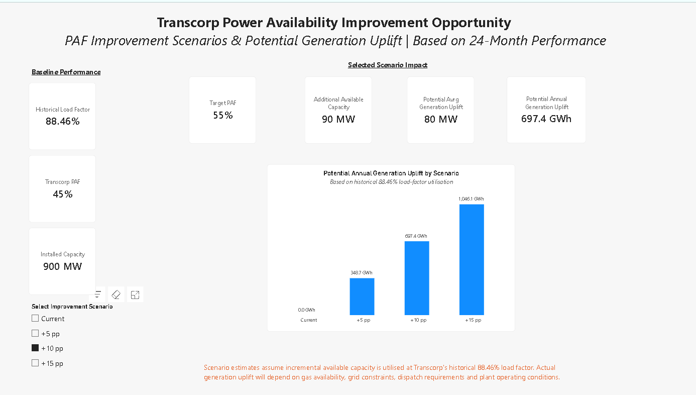

# Nigeria Power Generation Performance Benchmark

### Power BI | DAX | Power Query | Energy Performance Analytics

An interactive Power BI project benchmarking **Transcorp Power** against selected Nigerian generation peers using 24 months of operational performance data published by the **Nigerian Electricity Regulatory Commission (NERC)**.

**Analysis Period:** May 2024 – April 2026

**Benchmark Plants:** Transcorp Power (Delta GS) | Azura-Edo IPP | Egbin Power | Geregu Power

---

## 📊 Dashboard Preview

### Executive Performance Benchmark

*Executive benchmark comparing Transcorp Power with selected Nigerian generation peers across availability, capacity and operational performance.*

👉 **[Open the Interactive Power BI Dashboard]([PASTE-YOUR-POWER-BI-PUBLIC-LINK-HERE](https://app.powerbi.com/view?r=eyJrIjoiNzg5ZjI5MDYtNDlhMS00ZWQ1LWIyZDgtNTkxNjcwMDllMGVjIiwidCI6ImE4ZmVlMjljLTNmNDktNDdmZC1iOTRiLWM3MzEwNjdhMTkwNiJ9))**

---

## 📊 Project Overview

This project investigates how effectively Transcorp Power converts its installed generation capacity into available capacity and actual generation, and how its operational performance compares with selected Nigerian peer plants.

The analysis focuses on three questions:

1. How does Transcorp's plant availability compare with its peers?
2. Is the principal performance gap related to capacity availability or utilisation?
3. What potential generation uplift could result from improved Plant Availability Factor (PAF)?

---

## 🎯 Business Objective

The objective was to transform publicly available regulatory performance data into actionable operational insight.

The analysis benchmarks:

- Plant Availability Factor (PAF)
- Average Available Capacity
- Load Factor
- Average Generation Output
- Installed Capacity Conversion
- Capacity availability trends
- Potential generation uplift from improved availability

---

## 🛠️ Tools & Techniques

- **Power BI** – dashboard development and visual analytics
- **Power Query** – data preparation and transformation
- **DAX** – KPI calculations and scenario modelling
- **Data Modelling** – relationships and analytical structure
- **Benchmarking** – peer performance comparison
- **Scenario Analysis** – modelling availability improvement opportunities

---

## 🔍 Key Findings

Transcorp Power recorded an average **Plant Availability Factor of approximately 45%** over the 24-month analysis period, representing approximately **404 MW of average available capacity** from 900 MW installed capacity.

However, its **88.46% historical load factor** indicates that available capacity was generally well utilised.

The analysis therefore indicates that **capacity availability and reliability represent a larger performance opportunity than utilisation of capacity once available**.

The benchmark also identified a substantial availability gap between Transcorp and the strongest-performing peer within the selected benchmark group.

---

## 📈 Improvement Scenario Analysis

Three illustrative improvement scenarios were modelled:

| PAF Improvement | Target PAF | Additional Available Capacity | Potential Annual Generation Uplift |
|---|---:|---:|---:|
| +5 percentage points | 50% | 45 MW | ~348.7 GWh/year |
| +10 percentage points | 55% | 90 MW | ~697.4 GWh/year |
| +15 percentage points | 60% | 135 MW | ~1,046.1 GWh/year |

The scenarios apply Transcorp's historical **88.46% load factor** to incremental available capacity.

These scenarios are illustrative analytical estimates rather than forecasts. Actual generation would depend on factors including gas availability, grid constraints, dispatch requirements, outages and plant operating conditions.

### PAF Improvement Scenario Dashboard

*Interactive scenario modelling showing the potential capacity and generation impact of improving Transcorp Power's Plant Availability Factor.*

---

## 📑 Dashboard Structure

The Power BI solution contains six analytical pages:

1. **Executive Benchmark**
2. **Availability & Capacity**
3. **Improvement Opportunity**
4. **Generation & Utilisation**
5. **Executive Findings & Recommendations**
6. **Data Sources & Methodology**

---

## 🌐 Interactive Dashboard

👉 **[View the Interactive Power BI Dashboard](https://app.powerbi.com/view?r=eyJrIjoiNzg5ZjI5MDYtNDlhMS00ZWQ1LWIyZDgtNTkxNjcwMDllMGVjIiwidCI6ImE4ZmVlMjljLTNmNDktNDdmZC1iOTRiLWM3MzEwNjdhMTkwNiJ9)**

The published dashboard is interactive. Users can explore year-specific performance and test different PAF improvement scenarios.

---

## 📚 Data Source

**Nigerian Electricity Regulatory Commission (NERC)**  
Operational Performance Factsheets, May 2024 – April 2026.

Additional benchmarking measures, calculations and scenario models were developed by the analyst.

---

## ⚠️ Analytical Limitations

The analysis uses publicly available regulatory operational data and should not be interpreted as a detailed engineering root-cause assessment.

Further reliability analysis would require unit-level information such as forced outage rates, MTBF, MTTR, trip history, derating, maintenance backlog, heat rate and constraint-loss data.

---

## 👤 Analyst

**Ndubuisi Anozie**

Business & Data Analyst | Power & Energy Analytics

Power BI • SQL • Excel • DAX • Power Query • Business Analysis
